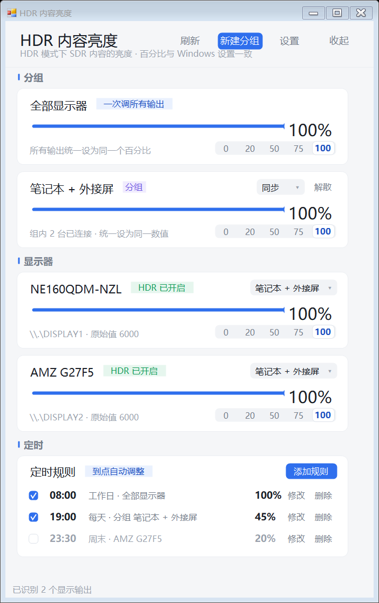
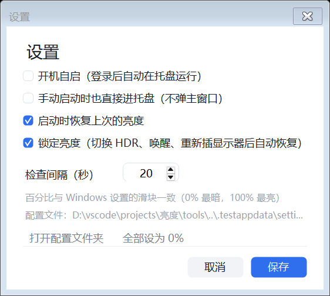
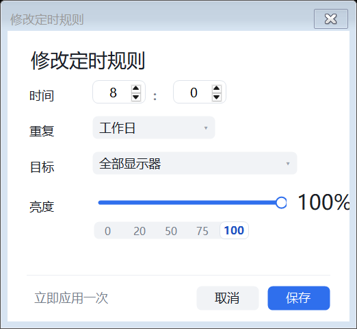

# HDR 内容亮度调节

按显示器单独调节 **Windows 显示设置里的“SDR 内容亮度”滑块**（HDR 开启时，控制 HDR 模式下 SDR 内容的亮度），
也可以把多台显示器捆绑成一组一起调。托盘常驻、开机自启、占用很低。

## 能做什么

- **单独调节**：每个显示输出一个滑块，互不影响。
- **常用按键**：每张卡片都有 `0 / 20 / 50 / 75 / 100` 五个常用亮度按钮，托盘右键菜单里也有一份。
- **定时规则**：可以设定“到点把某个目标调到某个百分比”，例如 08:00 → 100%、19:00 → 45%。
- **分组捆绑**：把显示器拖进（下拉选择）同一个分组后，拖一次组滑块就能同时调多台；
  - 「同步」模式：组内所有显示器设成同一个数值；
  - 「相对」模式：按同样增量调整，保持彼此之间的亮度差。
- **全部都调**：顶部“全部显示器一起调”一次性设置所有输出。
- **托盘常驻**：关窗口不退出，双击托盘图标重新打开；托盘右键菜单里有「常用亮度」子菜单
  （0/20/50/75/100%，作用于全部显示器；有分组时每个分组还有一份）。
- **开机自启**：写当前用户注册表 `Run` 项，不需要管理员权限。
- **自动恢复**：切换 HDR、休眠唤醒、插拔显示器后自动把数值改回上次设置（可在设置里关掉）。
- **配置保存**：`%APPDATA%\HdrBrightness\settings.json`。

## 界面

扁平化 + 简约风格，全部控件都是自绘的（自绘滑块、按钮、标签、分段选择器、下拉框、复选框），
没有系统控件的立体边框；配色统一为一套中性灰 + 单一主色，卡片为圆角白底：



设置窗口（同样风格）：



界面由离屏渲染核对排版：`tools/run-screenshot-testconfig.bat` 会把主窗口和设置窗口渲染成 PNG。

## 怎么用

直接运行 `dist\HdrBrightness.exe`：

1. 界面上每一行是一台显示器，拖动滑块即可生效。
2. 想把几台一起调：先在“新建分组”建一个组，然后在每个显示器卡片的右侧下拉框里选择该分组，
   之后拖分组卡片上的滑块就行。
3. 双击显示器名字可以改昵称（比如“主屏”“副屏”）。
4. 点右上角“×”只是收进托盘；要完全退出请用托盘图标右键 → 退出。
5. 界面底部「定时」区域可以添加规则：点「添加规则」选时间、重复的星期、目标和亮度，
   保存后会在到点自动执行；点规则行可以修改，行尾可以删除，行首的勾选框可以临时停用。

> 只有在显示器**开启 HDR** 时，这个数值才会影响画面。没开 HDR 的显示器会显示“HDR 未开启”的提示。

## 定时规则



- **时间**：24 小时制，精确到分钟。
- **重复**：每天 / 工作日 / 周末 / 单个星期几。
- **目标**：全部显示器、某个分组、或某一台显示器（按硬件路径记住，换接口也认得出来）。
- **亮度**：百分比，可用滑块或 `0 / 20 / 50 / 75 / 100` 常用按键。
- **执行方式**：程序每 20 秒检查一次，到点就应用；电脑睡眠/关机期间错过的规则，会在程序启动后
  **补执行一次**（回看最近 12 小时，取其中最后一条），所以开机启动后亮度会自动回到该有的状态。
- 规则会写进 `settings.json`，每行的勾选框可以临时停用而不删除。
- 「立即应用一次」按钮可以先试效果，确认后再保存。

## 命令行工具

`dist\hdrbright.exe` 可以脚本化调用，也用来排查问题：

```
hdrbright list                 列出所有活动显示输出、HDR 状态和当前亮度百分比
hdrbright get 1                读取 1 号显示器
hdrbright set 1 75             把 1 号显示器设为 75%
hdrbright set all raw:1500     直接写 API 原始值（1000 = 0%，6000 = 100%）
hdrbright debug                打印底层调用过程（排查问题时用）
```

## 数值与可调范围

界面统一用百分比：**0% 最暗、100% 最亮**，和 Windows 设置里的“SDR 内容亮度”滑块一致。
API 内部用的是“白点值”，本机实测（两台显示器逐个试写验证）**可调范围正好是 1000–6000**：
低于 1000 或高于 6000 的写入会被系统拒绝，所以滑块只在 0%–100% 之间取值，不再出现拖到头却没反应的情况。
卡片下方小字里仍会显示原始值，方便对不上时排查。

对应关系：`0% → 1000`、`20% → 2000`、`50% → 3500`、`75% → 4750`、`100% → 6000`。

## 实现说明（踩过的坑）

这个功能对应的官方接口是 `DisplayConfigGetDeviceInfo` / `DisplayConfigSetDeviceInfo`，
但有两个坑，写的时候都验证过：

1. **`DISPLAYCONFIG_DEVICE_INFO_HEADER` 的真实字段顺序是 `type, size, adapterId, id`**
   （不少资料和示例写成 `type, adapterId, id, size`，两者都是 20 字节，尺寸自检发现不了，
   但顺序错了会得到一个无意义的 LUID，接口只会返回“参数错误”）。
2. **写入 SDR 白点没有公开类型**。官方枚举里只有 `GET_SDR_WHITE_LEVEL = 11`，
   没有对应的 SET；Windows 设置里的滑块用的是未公开的 `0xFFFFFFEE`，
   请求结构比读取版多一个 `finalValue` 字节（1 = 最终值），按 4 字节对齐后 `size` 必须是 **28**。
   写入用的原始值必须是这个 28 字节的尺寸才会被接受（24 或 32 都会报参数错误）。

程序里两者都做了兼容：先按 28 字节的 `0xFFFFFFEE` 写，失败再回退到老系统的 12 号类型；
读显示器名字时也会在 420 字节（新系统）和 416 字节（老系统）之间自动切换。

## 构建

需要 .NET SDK（装过 Visual Studio 或 dotnet SDK 即可，目标框架 .NET Framework 4.8，Windows 自带）：

```powershell
powershell -ExecutionPolicy Bypass -File .\build.ps1
```

产物在 `dist\`：`HdrBrightness.exe`（主程序，约 76 KB）和 `hdrbright.exe`（命令行）。
构建脚本会把 NuGet 缓存和 dotnet 主目录放在仓库内的 `.packages` / `.dotnet`，不污染用户目录。

## 目录结构

```
src/Shared/                 显示配置 API 封装、设置模型、开机自启（主程序与 CLI 共用）
src/HdrBrightness/          WinForms 托盘程序
src/HdrBrightness.Cli/      命令行工具
tools/make-icon.ps1         生成 assets/app.ico
tools/probe.ps1             底层 API 探针（排查 DisplayConfig 报错用）
tools/run-on-desktop.ps1    在真实桌面启动进程并抓取控制台输出（调试用）
tools/run-debug.bat         在普通用户进程里跑一次 hdrbright debug
tools/run-screenshot.bat    把主窗口渲染成 shot.png / shot-demo.png（调试排版用）
tools/run-screenshot-testconfig.bat  用临时配置目录渲染界面（不碰真实配置）
```

调试时可以用环境变量 `HDRBRIGHTNESS_CONFIG_DIR` 指定另一个配置目录，程序不会读写默认位置。

## 读不到数值时

正常情况下两台显示器都会直接显示数值。如果卡片显示 `--` 并弹出橙色提示，说明系统拒绝了
显示配置查询。常见原因：

1. 显示器没开 HDR（未开启时数值仍然可写，只是不影响画面）。
2. 显卡驱动状态异常——重启一次通常能恢复；插拔/切换显示器后点“刷新”重试。
3. 系统的显示配置组件被安全软件或反作弊驱动拦截（少见），退出这类软件后再点“重新检测”。

点提示卡片上的“复制诊断信息”可以得到窗口站/桌面、每条显示路径的 LUID、各接口返回码等细节。
